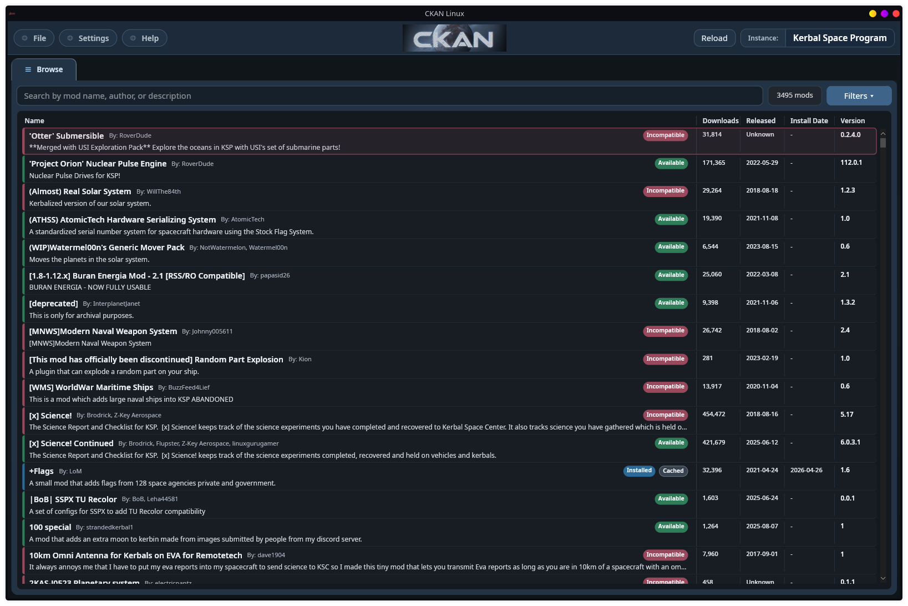

# CKAN LinuxGUI

CKAN LinuxGUI is this fork's Linux desktop shell for the Comprehensive Kerbal
Archive Network (CKAN). Its desktop entry point is `ckan-linux`, which launches
the self-contained `CKAN-LinuxGUI` Avalonia app. The shell uses the existing
CKAN core services for metadata, dependency resolution, installs, updates,
removals, and registry writes.

In Debian packages built from this fork, `/usr/bin/ckan` prefers the Avalonia
LinuxGUI for graphical no-argument launches. Command-style usage, such as
`ckan install`, `ckan remove`, or any other invocation with arguments, still
runs through the existing Mono `ckan.exe` command-line path. If no graphical
display is available, a no-argument launch opens the console UI instead. If
`ckan-linux` is unavailable, the wrapper falls back to the legacy `ckan.exe gui`
path.



## Desktop App Quick Start

```bash
git clone https://github.com/appaKappaK/CKAN-LinuxUI.git
cd CKAN-LinuxUI
./scripts/install-linuxgui.sh
ckan-linux
```

You do not need a separate upstream CKAN checkout. This fork already contains
the CKAN core alongside the LinuxGUI shell. The local installer installs under
`~/.local` by default and does not replace any system `ckan` command. If
`ckan-linux` is not on your `PATH`, launch it directly:

```bash
~/.local/bin/ckan-linux
```

The optional Rust catalog sidecar is not required for this flow.

## What This Fork Provides

- A native Linux desktop app built with Avalonia in `LinuxGUI/`.
- A local installer that builds LinuxGUI and installs `ckan-linux` under
  `~/.local` by default.
- A package layout under `_build/package/ckan-linux/linux-x64/` with the
  launcher, runtime files, icons, and desktop entry.
- Debian package integration that routes graphical no-argument `ckan` launches to
  `ckan-linux` while keeping argument-driven command and console behavior
  intact.
- Optional fast catalog browsing from an external Rust-generated sidecar index;
  normal installs work without Rust and fall back to CKAN's registry cache.
- LinuxGUI browser conveniences including clearable search, details-pane
  relationship browsing for mods that require the selected mod, non-modal
  installation-history cross-reference, and a File menu shortcut to the KSP
  `Ships` craft folders.
- A preview workflow that keeps dependency, recommendation, suggestion, and
  supported-mod lists compact while still allowing each section to scroll or
  open the related mods in Browse.
- Warm startup into the mod browser when the active or remembered install is
  already known, avoiding a brief instance-loading shell flash on launch.
- A first-run and recovery surface for choosing a registered KSP install when no
  active instance is available.
- Stale saved installs stay visible for explicit cleanup without recreating a
  deleted game folder just to initialize CKAN state.
- Visual coverage for the LinuxGUI in `LinuxGUI.VisualTests/`.

## Optional Rust Catalog Sidecar

LinuxGUI can use a catalog index generated by the separate
[`ckan-meta-rs`](https://github.com/appaKappaK/ckan-meta-rs) project to speed up
mod browser catalog/search loading. This is optional; normal installs work
without Rust and fall back to CKAN's registry cache.

See [`LinuxGUI/README.md`](LinuxGUI/README.md#rust-catalog-sidecar) for setup,
fallback behavior, and benchmark notes.

## Development

See [`LinuxGUI/README.md`](LinuxGUI/README.md) for LinuxGUI build, packaging,
development launcher, logging, benchmarks, and visual-test
workflow.

## Upstream CKAN Context

[](https://github.com/KSP-CKAN/CKAN/releases/latest)

[](https://coveralls.io/github/KSP-CKAN/CKAN?branch=master)
[](https://www.nuget.org/packages/CKAN)
[](https://crowdin.com/project/ckan)


[Click here to open a new CKAN issue][6]

[Click here to go to the CKAN wiki][5]

[Click here to view the CKAN metadata specification](Spec.md)

## What's the CKAN?

The CKAN is a metadata repository and associated tools to allow you to find, install, and manage mods for Kerbal Space Program.
It provides strong assurances that mods are installed in the way prescribed by their metadata files,
for the correct version of Kerbal Space Program, alongside their dependencies, and without any conflicting mods.

CKAN is great for players _and_ for authors:

- players can find new content and install it with just a few clicks;
- modders don't have to worry about misinstall problems or outdated versions;

The CKAN has been inspired by the solid and proven metadata formats from both the Debian project and the CPAN, each of which manages tens of thousands of packages.

## What's the status of the CKAN?

The CKAN is currently under [active development][1].
We very much welcome contributions, discussions, and especially pull-requests.

## The CKAN spec

At the core of the CKAN is the **[metadata specification](Spec.md)**,
which comes with a corresponding [JSON Schema](CKAN.schema) that you can also find in the [Schema Store][8]

This repository includes a validator that you can use to [validate your files][3].

## CKAN for players

CKAN can download, install and update mods in just a few clicks. See the [User guide][2] to get started with CKAN.

## CKAN for modders

While anyone can contribute metadata for your mod, we believe that you know your mod best.
So while contributors will endeavor to be as accurate as possible, we would appreciate any efforts made by mod authors to ensure our metadata's accuracy.
If the metadata we have is incorrect please [open an issue][7] and let us know.

## Contributing to CKAN

**No technical expertise is required to contribute to CKAN**

If you want to contribute, please read our [CONTRIBUTING][4] file.

## Thanks

Our sincere thanks to [SignPath.io][10] for allowing us to use their free code signing service, and to [the SignPath Foundation][11] for giving us a free code signing certificate!

---

Note: Are you looking for the Open Data portal software called CKAN? If so, their GitHub repository is found [here][9].

 [1]: https://github.com/KSP-CKAN/CKAN/commits/master
 [2]: https://github.com/KSP-CKAN/CKAN/wiki/User-guide
 [3]: https://github.com/KSP-CKAN/CKAN/wiki/Adding-a-mod-to-the-CKAN#verifying-metadata-files
 [4]: https://github.com/KSP-CKAN/.github/blob/master/CONTRIBUTING.md
 [5]: https://github.com/KSP-CKAN/CKAN/wiki
 [6]: https://github.com/KSP-CKAN/CKAN/issues/new
 [7]: https://github.com/KSP-CKAN/NetKAN/issues/new
 [8]: https://schemastore.org/
 [9]: https://github.com/ckan/ckan
 [10]: https://signpath.io/
 [11]: https://signpath.org/
