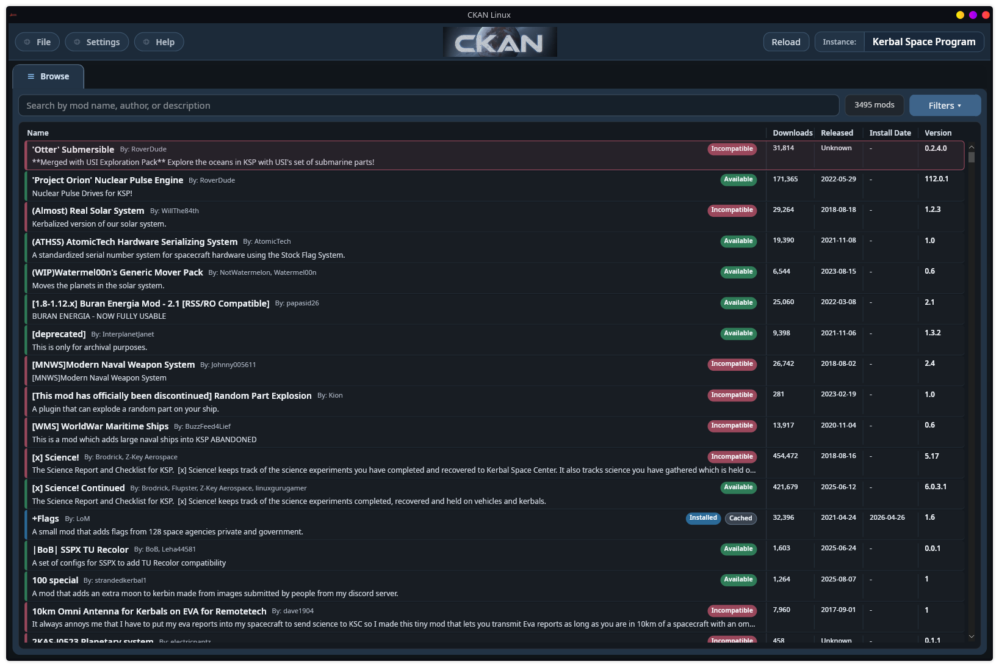

# CKAN LinuxGUI


A native Linux desktop app for the Comprehensive Kerbal Archive Network (CKAN), the mod manager for Kerbal Space Program. Built with Avalonia on top of the upstream CKAN core.



> **⚠️ Warning – Uninstall behavior is currently unreliable**  
> Uninstalling mods can incorrectly remove other packages.  
> Example: uninstalling Kopernicus removed Parallax.  
> This will be fixed in a future release.

## Status

LinuxGUI is under passive development. It was designed and directed by me and
implemented with AI assistance. The queue and preview logic is tested against a
real CKAN registry (`Tests/App/Services/`), including removal previews for
unused dependencies. Removing a mod that other installed mods depend on is not
covered by tests yet. The UI is covered by view-model tests and screenshot
baselines (`LinuxGUI.VisualTests/`). To run the visual tests:

```bash
./build.sh LinuxGUIVisualTests
```

## Quick Start

```bash
git clone https://github.com/appaKappaK/CKAN-LinuxUI.git
cd CKAN-LinuxUI
./scripts/install-linuxgui.sh
ckan-linux
```

No separate upstream CKAN checkout is needed; the CKAN core is included in this
repository. The installer puts everything under `~/.local` and does not replace
any system `ckan` command. If `ckan-linux` is not on your `PATH`, launch it
directly:

```bash
~/.local/bin/ckan-linux
```

## What This Fork Adds

- A native Linux desktop app, launched as `ckan-linux`.
- A queue-and-preview workflow: installs, updates, removals, and downloads are
  queued first, and a preview shows what will happen (including dependencies)
  before anything is applied.
- A local installer that adds `ckan-linux` without touching an existing system
  `ckan` command.
- An optional self-contained command-line build for scripts and recovery work.

The former WinForms and terminal interfaces are not included in this fork.

## Optional Command-Line Client

A separate .NET 8 build for scripting and headless maintenance. It does not
launch a GUI.

```bash
./build.sh CLI --configuration=Release
_build/publish/CKAN-CmdLine/linux-x64/CKAN-CmdLine version
```

The old `upgrade ckan` self-replacement path is disabled. Update checks for CKAN
Linux belong to the desktop app.

## Development

Build steps, packaging, the dev launcher, logs, benchmarks, and the visual-test
workflow are documented in [`LinuxGUI/README.md`](LinuxGUI/README.md).

Report problems with the Linux app on this repository's
[issue tracker](https://github.com/appaKappaK/CKAN-LinuxUI/issues/new).

## About CKAN

CKAN is a metadata repository and set of tools for finding, installing, and
managing Kerbal Space Program mods. It installs mods the way their metadata
prescribes, for the right game version, with their dependencies, and without
conflicts. It was inspired by the metadata formats of Debian and CPAN.

This fork carries the upstream CKAN core and adds the LinuxGUI shell. Core
development, metadata policy, and command-line behavior come from the
[upstream CKAN project](https://github.com/KSP-CKAN/CKAN), which is under
[active development](https://github.com/KSP-CKAN/CKAN/commits/master).

- [Upstream user guide](https://github.com/KSP-CKAN/CKAN/wiki/User-guide):
  useful for CKAN concepts, though its screenshots and layout will not match
  this app
- [Upstream releases](https://github.com/KSP-CKAN/CKAN/releases/latest)
- [Metadata specification](Spec.md) and its
  [JSON Schema](CKAN.schema), also available in the
  [Schema Store](https://schemastore.org/)
- [Validating metadata files](https://github.com/KSP-CKAN/CKAN/wiki/Adding-a-mod-to-the-CKAN#verifying-metadata-files)
- Mod authors: if the metadata for your mod is wrong,
  [open an issue](https://github.com/KSP-CKAN/NetKAN/issues/new)
- Contributing to CKAN metadata or core: see the upstream
  [CONTRIBUTING](https://github.com/KSP-CKAN/.github/blob/master/CONTRIBUTING.md)
  file

## License and Thanks

See [`LICENSE.md`](LICENSE.md). This fork builds on the work of the
[KSP-CKAN](https://github.com/KSP-CKAN/CKAN) project and its contributors.

---

Looking for the open-data portal software also called CKAN? Its repository is
[here](https://github.com/ckan/ckan).
